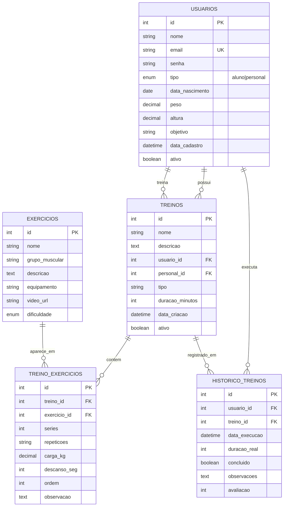

# 📊 Modelo Entidade-Relacionamento (MER)

## Diagrama ER

## Descrição dos relacionamentos

1. **USUARIOS → TREINOS (1:N)** — Cada aluno pode ter vários treinos cadastrados. Um personal pode criar treinos para vários alunos.

2. **TREINOS ↔ EXERCICIOS (N:N)** — Um treino possui vários exercícios, e um mesmo exercício aparece em vários treinos. A tabela associativa `TREINO_EXERCICIOS` guarda as informações específicas (séries, repetições, carga, tempo de descanso).

3. **USUARIOS → HISTORICO_TREINOS (1:N)** — Cada usuário tem vários registros de treinos executados ao longo do tempo.

4. **TREINOS → HISTORICO_TREINOS (1:N)** — Um treino pode ter sido executado várias vezes, cada execução gerando um registro no histórico.

## Chaves

- **PK** (Primary Key): chave primária de cada tabela
- **FK** (Foreign Key): chave estrangeira que referencia outra tabela
- **UK** (Unique Key): campo único (e-mail do usuário não pode repetir)
